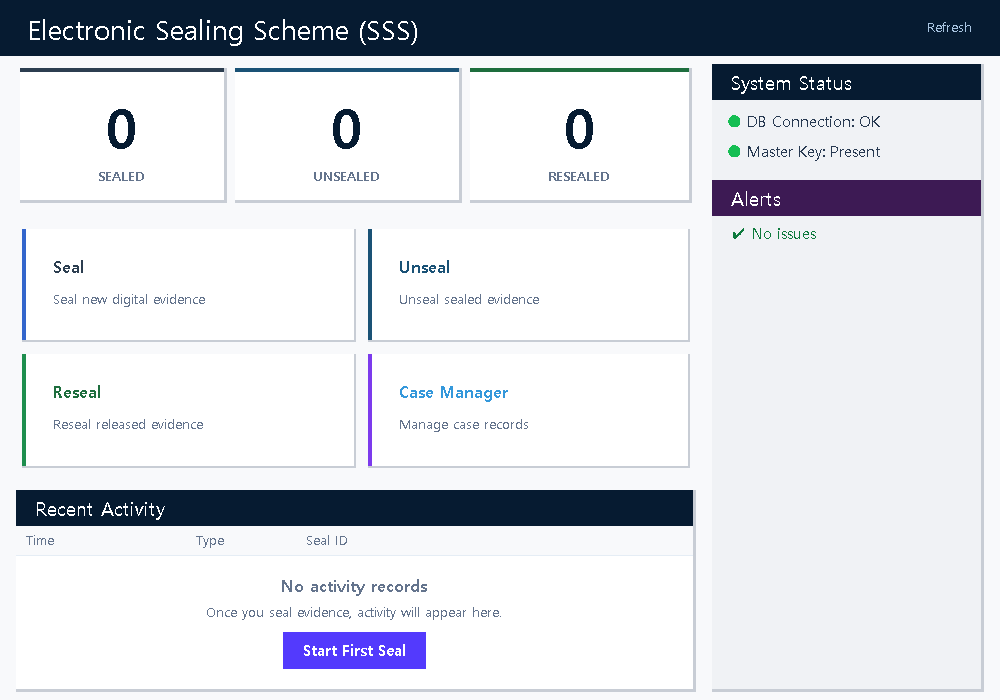
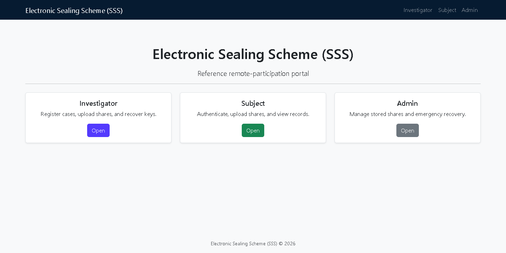
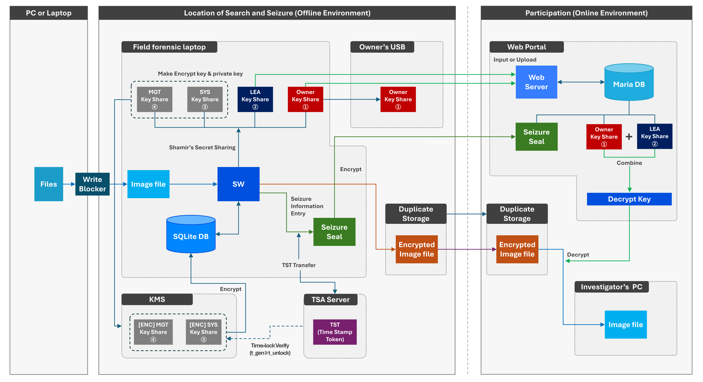
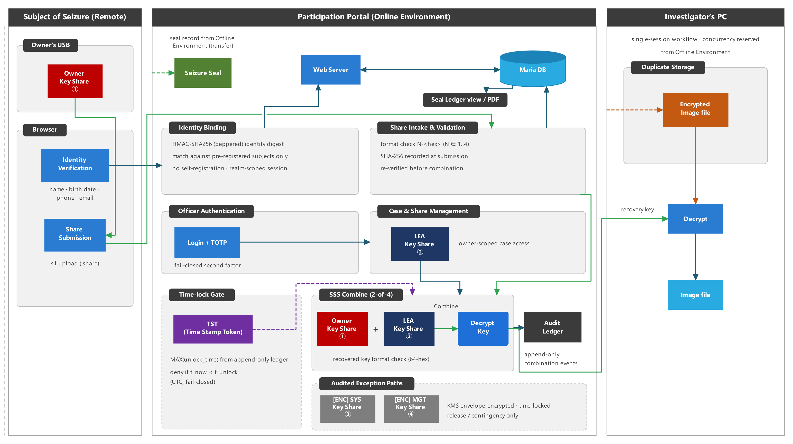

# Electronic Sealing Scheme (SSS)

Research prototype accompanying the manuscript *Prototype Design and
Implementation of an Electronic Sealing Scheme for Digital Evidence Using
Secret Key Sharing* (ICT Express, under revision).

The repository contains a desktop electronic-sealing prototype, a reference
web application, reproducible benchmark tooling, the remote-latency
measurement harness used by the study, and a protocol-level
[remote-participation architecture](docs/architecture-remote-participation.md).

## Scope and safety

This software is a research prototype, not a production-hardened digital
forensics system. Use synthetic inputs only; do not process case evidence,
personal data, or operational credentials.

Important prototype boundaries include:

- the desktop KMS uses a file-backed local master key;
- the bundled RFC 3161 responder is for local functional validation and shares
  the workstation time source;
- sealing credentials are generated locally and are not independently issued
  identity credentials;
- the reference web application stores submitted shares as application data
  and does not implement production-grade custody, deletion, or authorization
  controls; and
- the desktop unsealing path compares plaintext hashes with a selected JSON
  record but does not yet authenticate that JSON against the signed PDF.

The web application under `src/web` demonstrates the basic workflow. It is not
the evaluation portal used for the manuscript's reported remote-latency
measurement. The included measurement harness documents that evaluation
contract and requires a compatible local deployment.

## Screenshots

The screenshots below were captured from the included applications using
synthetic, empty-state data: the English desktop dashboard and the English
portal landing page.

### Desktop application



*Desktop dashboard — English, fresh empty profile.*

### Reference web application



*Reference web portal landing page — English, fresh empty SQLite database.*

## Architecture figures

The repository includes two reviewed, metadata-sanitized PDF figures from the
manuscript architecture:

- [overall system architecture](docs/architecture-overview.pdf); and
- [remote-participation evaluation architecture](docs/architecture-remote-participation-evaluation.pdf).

These are conceptual and evaluation-architecture figures, not
implementation-conformance claims. In particular, the remote-participation
figure depicts deployment-specific controls of the manuscript evaluation
portal. The public `src/web` reference application does not implement every
control shown in that figure. The overview also includes intended operational
context—such as write-blocker acquisition, physical owner-USB handoff, and a
dedicated TSA/KMS time-lock path—that the public build does not automate. See
the
[architecture document](docs/architecture-remote-participation.md) for the
precise implementation and trust boundaries.

### Overall system architecture

[](docs/architecture-overview.pdf)

*Select the image to open the PDF version.*

### Remote-participation evaluation architecture

[](docs/architecture-remote-participation-evaluation.pdf)

*Select the image to open the PDF version.*

## Components

| Path | Purpose |
|---|---|
| `src/desktop` | Tkinter sealing, unsealing, resealing, record, KMS, TSA, and signature prototype |
| `src/web` | Reference Flask workflow for case registration, subject authentication, share submission, and recovery |
| `scripts/run_performance_benchmark.py` | Streaming AES-GCM benchmark and LaTeX/CSV/JSON output generator |
| `scripts/run_benchmark_pipeline.py` | Plan, run, and merge staged benchmark batches |
| `scripts/generate_performance_figure.py` | Vector throughput figure from recorded benchmark artifacts (companion to `--emit-only`; requires matplotlib) |
| `scripts/measure_remote_latency.py` | Client-observed timing harness for the documented evaluation-portal contract |
| `tests` | Unit, integration, and workflow regression tests |

The recovery key is divided with a vendored Python 3-compatible adaptation of
the MIT-licensed `secretsharing` 0.2.6 implementation. Provenance and the
upstream license are provided under
`src/desktop/crypto/_vendor/secretsharing/`.

## Requirements

- Python 3.12 or newer
- Windows 10/11 for the primary desktop workflow
- macOS or Linux for non-GUI tests and selected tooling

Create an isolated environment and install the declared dependencies:

```text
python -m venv .venv
```

Activate the environment before installing packages:

```text
# Windows PowerShell
.\.venv\Scripts\Activate.ps1

# macOS or Linux
source .venv/bin/activate

python -m pip install --upgrade pip
python -m pip install -r requirements.txt
```

## Test

Run the full automated suite from the repository root:

```text
python -m pytest -q
python tests/e2e_logic_verify.py
python tests/e2e_auto_test.py
```

The tests create temporary synthetic inputs and must not be pointed at case
data.

## Desktop prototype

Before the first desktop launch, provide strong values through the process
environment for both:

- `ENC_ENVELOPE_TSA_KEY_PASSWORD`
- `ENC_ENVELOPE_TSA_CA_KEY_PASSWORD`

Do not place these values in source files or commit them to the repository.
Then start the desktop application:

```text
python src/desktop/main.py
```

The application creates its prototype database, master key, and local TSA
credentials below `~/.enc_envelope/`. Existing TSA credentials created by an
older development build may use a different password. Back them up and rotate
them explicitly; the application does not overwrite an existing key during a
failed load.

## Reference web application

Run the reference Flask application on loopback only:

```text
python -m flask --app src.web.app:create_app run --host 127.0.0.1
```

Development defaults, mock email delivery, and the reference authorization
model are unsuitable for an exposed service. Set `ADMIN_PASSWORD` in the
process environment to enable the prototype admin login; when it is absent,
admin login fails closed.

## Benchmark reproduction

For a short functional run, create a synthetic file and pass it explicitly:

```text
python scripts/run_performance_benchmark.py --input-files path/to/synthetic.bin --chunk-sizes-gb 1 --repeats 1 --baselines copy read --baseline-repeats 1 --output-dir output/smoke --latex-dir output/smoke/generated
```

The manuscript-scale defaults require hundreds of GiB of free space and
substantial execution time. Review the plan and output paths before starting a
full run.

To regenerate report files from an existing benchmark artifact directory
without repeating encryption and I/O measurements, use `--emit-only` with the
same case and output configuration:

```text
python scripts/run_performance_benchmark.py --emit-only --output-dir path/to/existing-artifacts --latex-dir path/to/generated-output
```

The remote-latency harness is intentionally local-only. Its required
environment variables and endpoint contract are documented by:

```text
python scripts/measure_remote_latency.py --help
```

## License

Project code is released under the [MIT License](LICENSE). The vendored
`secretsharing` component retains its own MIT license and provenance notice in
its source directory. See [Third-Party Notices](THIRD_PARTY_NOTICES.md) for
redistributed component attribution.
