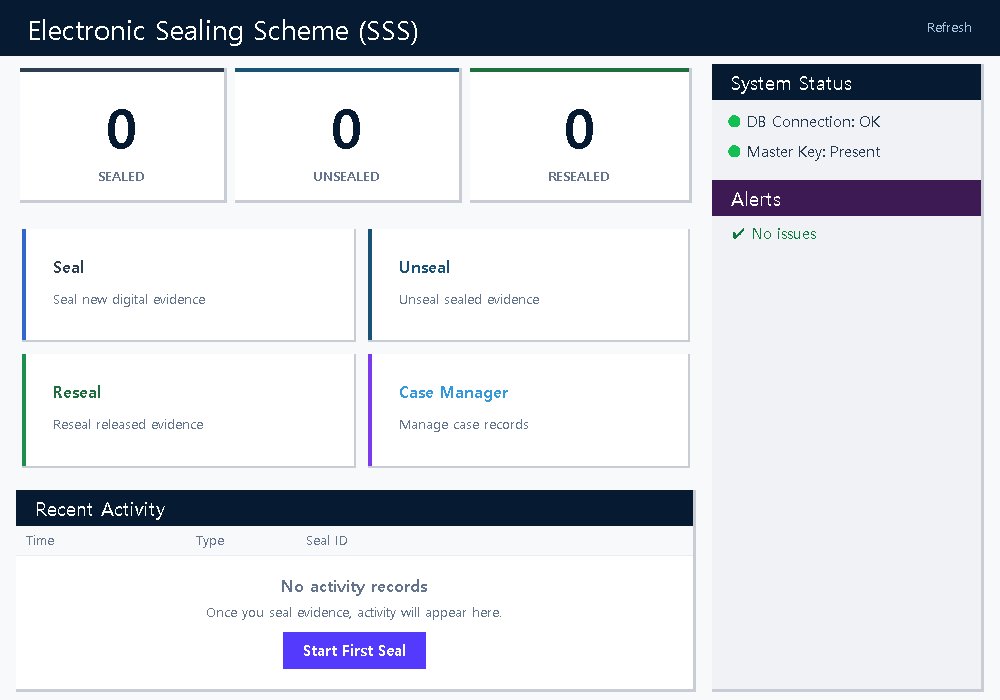
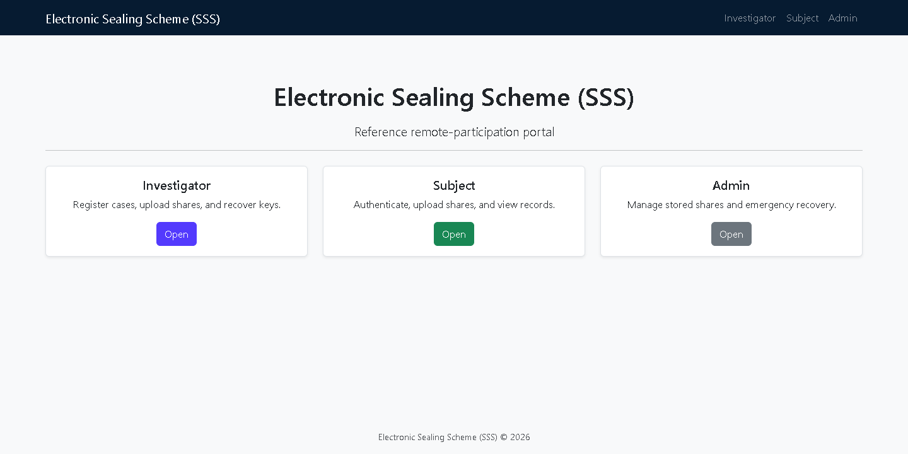
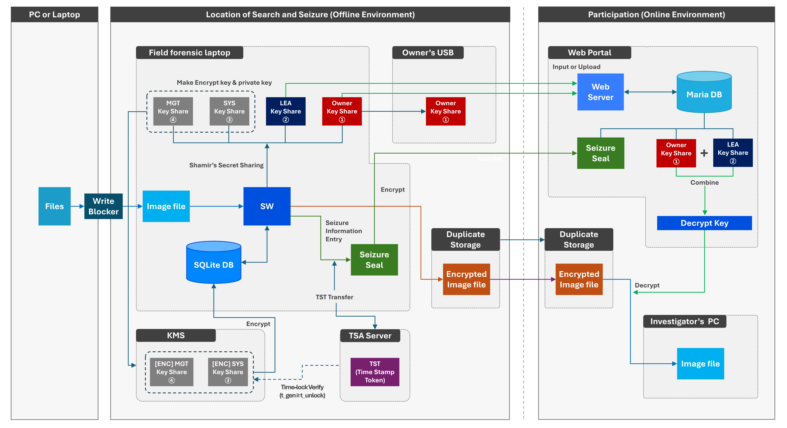
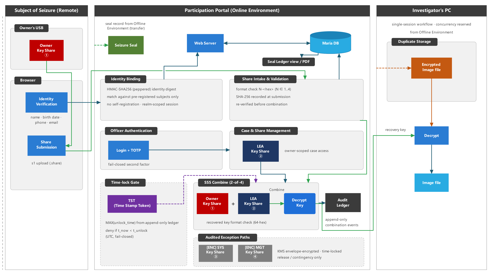

# Electronic Sealing Scheme (SSS)

Research prototype accompanying the manuscript *Prototype Design and
Implementation of an Electronic Sealing Scheme for Digital Evidence Using
Secret Key Sharing* (ICT Express, under revision).

The repository contains a desktop electronic-sealing prototype, a reference
web application, reproducible benchmark tooling, the remote-latency
measurement harness used by the study, and a protocol-level
[remote-participation architecture](docs/architecture-remote-participation.md).

## Scope and safety

This software is a research prototype, not a production-hardened digital
forensics system. Use synthetic inputs only; do not process case evidence,
personal data, or operational credentials.

Important prototype boundaries include:

- the desktop KMS uses a file-backed local master key;
- the bundled RFC 3161 responder is for local functional validation and shares
  the workstation time source;
- sealing credentials are generated locally and are not independently issued
  identity credentials;
- the reference web application stores submitted shares as application data
  and does not implement production-grade custody, deletion, or authorization
  controls;
- the reference web application keeps the subject's identity in its case
  table only as keyed digests and ciphertexts, and synced seal records
  (which carry signer details) and their PDFs only as ciphertexts, under
  file-backed local keys on the application host; and
- the desktop unsealing path compares plaintext hashes with a selected JSON
  record but does not yet authenticate that JSON against the signed PDF.

The web application under `src/web` demonstrates the basic workflow. It is not
the evaluation portal used for the manuscript's reported remote-latency
measurement. The included measurement harness documents that evaluation
contract and requires a compatible local deployment.

## Screenshots

The screenshots below were captured from the included applications using
synthetic, empty-state data: the English desktop dashboard and the English
portal landing page.

### Desktop application



*Desktop dashboard — English, fresh empty profile.*

### Reference web application



*Reference web portal landing page — English, fresh empty SQLite database.*

## Architecture figures

The repository includes two reviewed, metadata-sanitized PDF figures from the
manuscript architecture:

- [overall system architecture](docs/architecture-overview.pdf); and
- [remote-participation evaluation architecture](docs/architecture-remote-participation-evaluation.pdf).

These are conceptual and evaluation-architecture figures, not
implementation-conformance claims. In particular, the remote-participation
figure depicts deployment-specific controls of the manuscript evaluation
portal. The public `src/web` reference application does not implement every
control shown in that figure. The overview also includes intended operational
context—such as write-blocker acquisition, physical owner-USB handoff, and a
dedicated TSA/KMS time-lock path—that the public build does not automate. See
the
[architecture document](docs/architecture-remote-participation.md) for the
precise implementation and trust boundaries.

### Overall system architecture

[](docs/architecture-overview.pdf)

*Select the image to open the PDF version.*

### Remote-participation evaluation architecture

[](docs/architecture-remote-participation-evaluation.pdf)

*Select the image to open the PDF version.*

## Components

| Path | Purpose |
|---|---|
| `src/desktop` | Tkinter sealing, unsealing, resealing, record, KMS, TSA, and signature prototype |
| `src/web` | Reference Flask workflow for case registration, subject authentication, share submission, and recovery |
| `scripts/run_performance_benchmark.py` | Streaming AES-GCM benchmark and LaTeX/CSV/JSON output generator |
| `scripts/run_benchmark_pipeline.py` | Plan, run, and merge staged benchmark batches |
| `scripts/generate_performance_figure.py` | Vector throughput figure from recorded benchmark artifacts (companion to `--emit-only`; requires matplotlib) |
| `scripts/measure_remote_latency.py` | Client-observed timing harness for the documented evaluation-portal contract |
| `tests` | Unit, integration, and workflow regression tests |

The recovery key is divided with a vendored Python 3-compatible adaptation of
the MIT-licensed `secretsharing` 0.2.6 implementation. Provenance and the
upstream license are provided under
`src/desktop/crypto/_vendor/secretsharing/`.

## Requirements

- Python 3.12 or newer
- Windows 10/11 for the primary desktop workflow
- macOS or Linux for non-GUI tests and selected tooling

Create an isolated environment and install the declared dependencies:

```text
python -m venv .venv
```

Activate the environment before installing packages:

```text
# Windows PowerShell
.\.venv\Scripts\Activate.ps1

# macOS or Linux
source .venv/bin/activate

python -m pip install --upgrade pip
python -m pip install -r requirements.txt
```

## Test

Run the full automated suite from the repository root:

```text
python -m pytest -q
python tests/e2e_logic_verify.py
python tests/e2e_auto_test.py
```

The tests create temporary synthetic inputs and must not be pointed at case
data.

## Desktop prototype

Before the first desktop launch, provide strong values through the process
environment for both:

- `ENC_ENVELOPE_TSA_KEY_PASSWORD`
- `ENC_ENVELOPE_TSA_CA_KEY_PASSWORD`

Do not place these values in source files or commit them to the repository.
Then start the desktop application:

```text
python src/desktop/main.py
```

The application creates its prototype database, master key, and local TSA
credentials below `~/.enc_envelope/`. Existing TSA credentials created by an
older development build may use a different password. Back them up and rotate
them explicitly; the application does not overwrite an existing key during a
failed load.

## Reference web application

Run the reference Flask application on loopback only, after setting the
two key paths described below (it does not start without them):

```text
python -m flask --app src.web.app:create_app run --host 127.0.0.1
```

Development defaults, mock email delivery, and the reference authorization
model are unsuitable for an exposed service. The admin login uses named
accounts, and none exists by default. Create them from the repository root
with the same environment as the web application; `create` asks for the
password twice without echo, or reads one line of standard input with
`--password-stdin`:

```text
python -m src.web.admin_accounts create <username>
python -m src.web.admin_accounts list
python -m src.web.admin_accounts disable <username>
```

Passwords need at least 12 characters and are stored as scrypt hashes.
Disabling an account also ends its open sessions. The shared
`ADMIN_PASSWORD` of v1.0.1 is ignored; while it is still set, the
application logs a warning at start-up.
Every emergency recovery attempt that reaches the release gate records the
administrator's account name in the release audit table
(`release_audit.operator`), and every attempt is logged in one warning line
with the account name, the seal, the outcome, the share slots used and the
reason. After repeated failed logins from one client address, the admin
login refuses that address for a while (`AUTH_MAX_FAILURES`,
`AUTH_LOCKOUT_SECONDS`); each attempt reserves its place before the
password check, so concurrent attempts cannot exceed that budget. At most
`ADMIN_LOGIN_MAX_CONCURRENT` password checks (default 4) run at once in
each worker process; further concurrent logins are refused with 503.

The application needs two key files, set by path, and does not start
without them: `IDENTITY_PEPPER_PATH` (32 to 1024 random bytes) and
`PRIVACY_KMS_MASTER_KEY_PATH` (32 random bytes, not the release master
key). Create each once and keep a backup: a new pepper makes every stored
digest unmatchable, and without the master key the stored names, e-mail
addresses and seal records cannot be read.

```text
python -c "import os; open('identity_pepper.bin', 'xb').write(os.urandom(32))"
python -c "import os; open('privacy_master.key', 'xb').write(os.urandom(32))"
```

The subject's name, birth date and phone number are stored as keyed digests
(HMAC-SHA256) and compared in constant time; formatting of the birth date
and phone number is ignored. The name and e-mail address are stored
encrypted under a per-seal data key, and the e-mail address is decrypted
only to send a one-time code after the subject's other factors match, with
an audit row per decryption. New case passwords need at least 12 characters
and are stored as scrypt hashes. Registrations that set a case password are
limited per client address (`CASE_REGISTRATION_MAX_PER_ADDRESS` within
`CASE_REGISTRATION_WINDOW_SECONDS`, 429 beyond), and at most
`CASE_PASSWORD_MAX_CONCURRENT` case-password checks (default 4) run at once
in each worker process; further ones are refused with 503.

Synced seal records and their PDFs are
stored encrypted under the seal's data key (AES-256-GCM, bound to the seal,
the event and the column); the subject's record view and PDF download
decrypt them after authentication, again with an audit row per decryption.
Unset or unusable keys stop the application at start-up; a key file that
becomes unreadable later makes these routes, and record synchronization,
answer 503. A database
created before this version keeps plaintext identities and synced records,
which the application refuses to use until they are converted. Run the
conversion from the repository root with `src` on `PYTHONPATH` (it imports
the desktop crypto package):

```text
python -m src.web.privacy.migrate --dry-run
python -m src.web.privacy.migrate --apply
```

## Record synchronization

When a seal, an unsealing or a reseal is saved, the desktop writes one
entry per configured backend to a queue in its database (`sync_outbox`),
in the same transaction, and then sends the entries. If an entry cannot
be written, the step fails and saves nothing; run it again. An entry
counts as sent only when the endpoint acknowledges it: for the reference
web application a JSON `status` of `"ok"`; for the portal, whose contract
names no success value, any HTTP 200 JSON answer whose `status` is not
`error`, `fail`, `failed` or `failure` (an inferred rule; that the portal
stored the record was not verified). A failed or unacknowledged send stays
queued. Nothing is queued for a
backend that is not configured. Both backends refuse plain HTTP beyond
loopback and follow no redirect, so configure the final URL.

- Reference web application: `ENC_ENVELOPE_SYNC_WEB_URL` (base URL). With
  the institutional seal-policy key configured
  (`ENC_ENVELOPE_POLICY_KEY_PATH`, `ENC_ENVELOPE_POLICY_CERT_PATH`,
  `ENC_ENVELOPE_POLICY_KEY_PASSWORD`), every submission carries an envelope
  signed with that key, with a fresh nonce and time for each attempt.
- A separately operated portal (HMAC contract):
  `ENC_ENVELOPE_SYNC_PORTAL_URL` and `SYNC_SHARED_SECRET`. A record is
  checked against the contract's required fields before it is sent.

Check and resend queued records, with `src` on `PYTHONPATH`:

```text
python -m desktop.sync status
python -m desktop.sync retry
```

On the web application, `SYNC_REQUIRE_SIGNATURE=true` refuses unsigned
submissions (it needs `POLICY_CA_CERT_PATH`); a present but invalid
signature is always refused. `SYNC_SIGNATURE_WINDOW_SECONDS` (default 300,
30 to 3600) bounds the clock distance of a signed submission. Seal policies
carry a generation (sealing 1, each reseal the previous + 1), and the web
application refuses an older generation of a seal once it has admitted a
newer one. The switch is off by default, and the properties that rest on
who submitted a record hold only with it on: with it off, anyone can
submit unsigned records (see the limitations below).

## Known limitations of v1.1

- **Synchronization is authenticated only with `SYNC_REQUIRE_SIGNATURE=true`.**
  Both protective switches, this one and `RELEASE_REQUIRE_POLICY`, are off
  by default. With the sync switch off, an exact copy of a stored record
  under another event id is refused when its policy authenticates against
  the pinned policy CA (records without such a policy keep the earlier
  admission rules), but a copy with any field outside the signed policy
  changed is admitted: whoever holds a seal's signed record
  can take a future event id of that seal, the desktop's genuine record for
  that event is then refused, and the seal's later records stay queued for
  that backend. Without `RELEASE_REQUIRE_POLICY`, a seal that never had an
  authenticated policy can still be released on its unauthenticated records
  (the standard path then needs the record's key commitment, and the admin
  path flags the release).
- **Share slots are not versioned by reseal.** Each share slot keeps the
  first share stored for it. If share 1 of an earlier generation was
  uploaded, the resealed share 1 cannot be uploaded, and the paths that
  combine the stored share 1 with the new policy (the standard path and the
  strict time-locked path) end in a commitment mismatch. The standard-mode
  time-locked path uses the presented share 2 and the wrapped share 3 and is
  not affected; the admin path is not a documented remedy.
- **Case registration is unauthenticated and can be pre-empted.** A seal's
  records are accepted only after its case is registered. Whoever learns a
  seal id first can register the case with their own identity values; the
  genuine registration is then refused, and the seal's identity binding
  and data key belong to that registration.
- **The identity-protection keys are required.** The web application does
  not start without them; a key file lost later makes registration, subject
  authentication and synchronization answer 503 and denies every release on
  a seal with records. There is no key rotation: replacing the identity
  pepper, the privacy master key or the release master key makes what it
  protects unusable.
- **Seal ids are coordinated by hand.** The case is registered on the web
  under the seal id the desktop generated; the desktop's daily id space is
  24 bits (`S-YYYYMMDD-` and six hexadecimal digits).
- **Plaintext outside the web tables.** The desktop database and its sync
  outbox keep records and PDFs in plaintext. Converting an older web
  database removes plaintext from its tables, but copies can remain in
  backups, in MariaDB logs and pages, and in earlier logs.
- **The separately operated portal is unchanged** by v1.1. The desktop's
  portal backend conforms to the portal's interface contract document; the
  portal's acceptance, storage, idempotence and generation handling were
  not tested.
- **Trust boundaries of the checks.** The TSA check accepts a certificate
  issued directly by a pinned TSA CA, RSA only, without revocation checking
  (CRL/OCSP) or full path validation. Audit tables, the policy-generation
  mark and the account table are application state: anyone with write
  access to the web database can change or remove them. A lost per-seal
  data-key row can only be restored from a backup; the master key alone
  does not recreate it. Converting an SQLite database removes old copies
  only when no other connection is open. Investigators have no accounts
  and no record view.
- **Evidence behind this release.** The automated test results are the
  developers' runs (Windows host and a MariaDB container). Independent
  reviews of the release candidate were static reviews of the source; one
  of them did not include the GUI wizard modules, `db_models.py` and
  `pdf_signer.py`.
- **The bundled RFC 3161 responder is a reference component** with a
  placeholder policy OID; a deployment needs a TSA whose default policy is
  the pinned OID.

## Benchmark reproduction

For a short functional run, create a synthetic file and pass it explicitly:

```text
python scripts/run_performance_benchmark.py --input-files path/to/synthetic.bin --chunk-sizes-gb 1 --repeats 1 --baselines copy read --baseline-repeats 1 --output-dir output/smoke --latex-dir output/smoke/generated
```

The manuscript-scale defaults require hundreds of GiB of free space and
substantial execution time. Review the plan and output paths before starting a
full run.

To regenerate report files from an existing benchmark artifact directory
without repeating encryption and I/O measurements, use `--emit-only` with the
same case and output configuration:

```text
python scripts/run_performance_benchmark.py --emit-only --output-dir path/to/existing-artifacts --latex-dir path/to/generated-output
```

The remote-latency harness is intentionally local-only. Its required
environment variables and endpoint contract are documented by:

```text
python scripts/measure_remote_latency.py --help
```

## License

Project code is released under the [MIT License](LICENSE). The vendored
`secretsharing` component retains its own MIT license and provenance notice in
its source directory. See [Third-Party Notices](THIRD_PARTY_NOTICES.md) for
redistributed component attribution.
