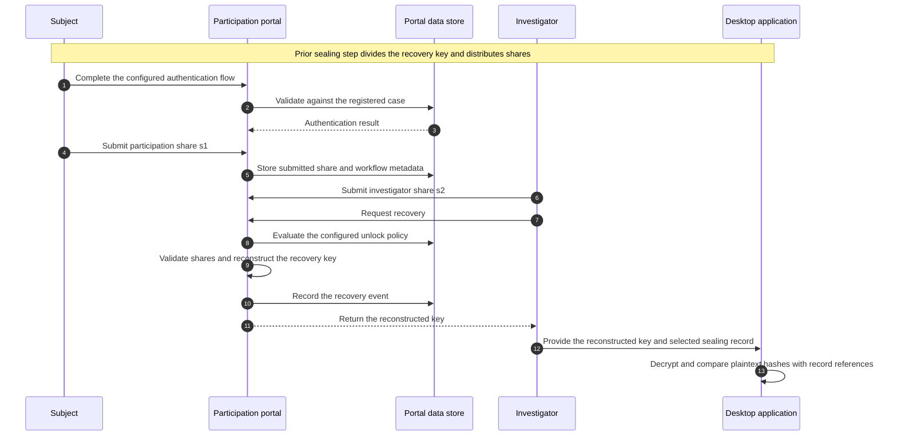

# Remote Participation Architecture

This document describes the protocol-level remote-participation workflow for
the Electronic Sealing Scheme (SSS) research prototype.

## Implementation scope

The repository contains two related but distinct artifacts:

1. `src/web` is a reference Flask implementation of the basic case,
   authentication, share-submission, and recovery workflow.
2. `scripts/measure_remote_latency.py` records client-observed request timing
   for the evaluation-portal contract used in the manuscript.

The reference web application is not endpoint-compatible with the evaluation
portal and does not reproduce its stronger deployment-specific identity and
investigator-session controls. The measurement harness therefore requires a
compatible local test deployment. Neither artifact is production hardened.

## Architecture figures

Two reviewed PDF figures accompany this document:

- [Overall system architecture](architecture-overview.pdf) presents the
  conceptual manuscript-level topology across the offline sealing, transfer,
  and online participation stages.
- [Remote-participation evaluation architecture](architecture-remote-participation-evaluation.pdf)
  expands the online evaluation-portal workflow.

The figures are architectural references rather than assertions that every
depicted component exists in the public implementation. The overview includes
the intended acquisition context, physical owner-USB distribution, and a
dedicated TSA/KMS time-lock path. The public desktop instead accepts
operator-selected input files, returns participation shares for operator
distribution, uses its local RFC 3161 responder for record timestamping, and
does not automate write-blocker acquisition or USB delivery. The reference
portal evaluates its unlock policy against the server clock. In addition,
identity binding, fail-closed investigator TOTP, owner-scoped authorization,
and append-only audit-ledger labels in the evaluation figure describe the
manuscript evaluation-portal design. They do not override the implementation
scope and prototype limitations stated in this document.

### Overall system architecture

*Select the image to open the PDF version.*

### Remote-participation evaluation architecture

*Select the image to open the PDF version.*

## Roles and key shares

The AES-256 evidence-encryption key is divided with Shamir's Secret Sharing
under the configured threshold policy. The standard research configuration
uses four shares and a two-share threshold:

| Share | Intended holder | Prototype role |
|---|---|---|
| `s1` | Subject of seizure | Participation share used in the standard path |
| `s2` | Investigator | Investigative-agency share used in the standard path |
| `s3` | System | File-backed KMS-wrapped exception share |
| `s4` | Administrator | File-backed KMS-wrapped contingency share |

The standard path combines `s1` and `s2`. The remaining shares model audited
exception paths; the prototype does not provide cryptographic resistance to
every two-holder coalition.

## Components

- **Desktop application**: accepts an evidence image or other input file,
  performs segmented AES-256-GCM encryption, divides the recovery key,
  generates lifecycle records, and performs final unsealing.
- **Reference web application**: demonstrates case registration, configurable
  subject authentication, share submission, recovery, and record display.
- **Prototype databases**: store case and workflow state. Submitted portal
  shares remain stored as application data in the reference implementation.
- **Local KMS**: protects internal shares with a file-backed master key.
- **Local RFC 3161 responder**: supports functional timestamp validation and
  uses the workstation clock. An independently administered TSA is required
  for an independent time source.
- **Application audit records**: record workflow events. They are not a
  production append-only ledger.

## Standard recovery sequence

## Integrity boundaries

- Each encrypted segment is protected by AES-GCM.
- The desktop unsealing path can compare the resulting plaintext hashes with
  reference hashes from a selected sealing-record JSON file.
- The current path does not authenticate that selected JSON file against the
  signed PDF. Record custody is therefore part of the prototype trust
  boundary.
- The reference portal validates share formatting and reconstructs according
  to the configured threshold policy. Submitted shares are not automatically
  deleted after use.

## Time and authorization boundaries

The reference portal compares the recorded unlock policy with its server
clock. The bundled RFC 3161 responder is used for local record-timestamp
functionality and does not make the portal clock independent. Production
deployment requires an external trusted time source, protected share storage,
event-bound authorization, and explicit retention or deletion controls.

## Evaluation scope

The reported remote measurement consists of repeated subject-share submission
and investigator-combination requests within one persistent two-role session
pair on a local deployment. It excludes initial authentication setup, human
navigation time, wide-area transfer, and concurrent multi-session behavior.
The timing script also performs test-data cleanup outside the measured
segments.
